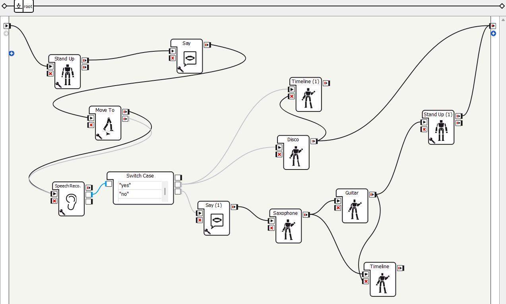

# NAO Robot Interactive Performance Program

Este proyecto contiene un script modular de Python que da vida al robot NAO con **voz**, **movimiento**, **comandos de voz interactivos** y **animaciones de actuación** como un **baile disco**, una **interpretación de saxofón** y un **solo de guitarra eléctrica**. El robot escucha la entrada del usuario y responde con una divertida rutina de actuación ramificada.

Link del video: https://youtu.be/6Q7GennK_94

---

## Estructura del programa
nao_project/

├── main.py # Script principal para controlar el flujo del programa

├── standUp.py # Contiene funciones para despertarse, ponerse de pie y descansar.

├── say.py # Contiene funciones para todas las interacciones habladas.

├── moveTo.py # Maneja caminar y bailar disco.

├── audio/

│ ├── epicsax.ogg # audio de saxofón

│ └── sonido-de-guitarra-electrica.wav # audio de guitarra electrica

---

## Flujo del programa

1. **Startup**
   - El robot se despierta y adopta la postura de `StandInit`.
   - Dice: _"Hello, whats up? lets have fun"_

2. **Movimiento**
   - El robot camina **20 cm** hacia adelante usando `ALMotion.moveTo`.

3. **Escucha de comandos de voz**
   - El robot utiliza el módulo **ALSpeechRecognition** para escuchar una respuesta **"yes"** o **"no"** del usuario.

4. **Branching Logic**
   - Si la respuesta es **"yes"**, entonces:
     - Hace un **disco dance**.
     - Restablece la postura utilizando la función `stand_up()`.
     - Finaliza el programa.

   - Si la respuesta es **"no"**, entonces:
     - Dice: _“Then, I’mma play an instrument.”_
     - Toca el **saxofón** (gesto + sonido).
     - Toca la **guitarra eléctrica** (gesto + sonido).
     - Restablece la postura utilizando la función `stand_up()`.
     - Finaliza el programa.

---

## Descripciones detalladas de funciones

---

### `main.py`

Este es el script de ejecución principal. Hace:

- Inicializa los proxies a `ALTextToSpeech`, `ALMotion`, `ALRobotPosture`, `ALAudioPlayer`, and `ALSpeechRecognition`.
- Orquesta toda la lógica del programa.
- Importa funciones de los otros módulos y maneja el árbol de decisiones.
